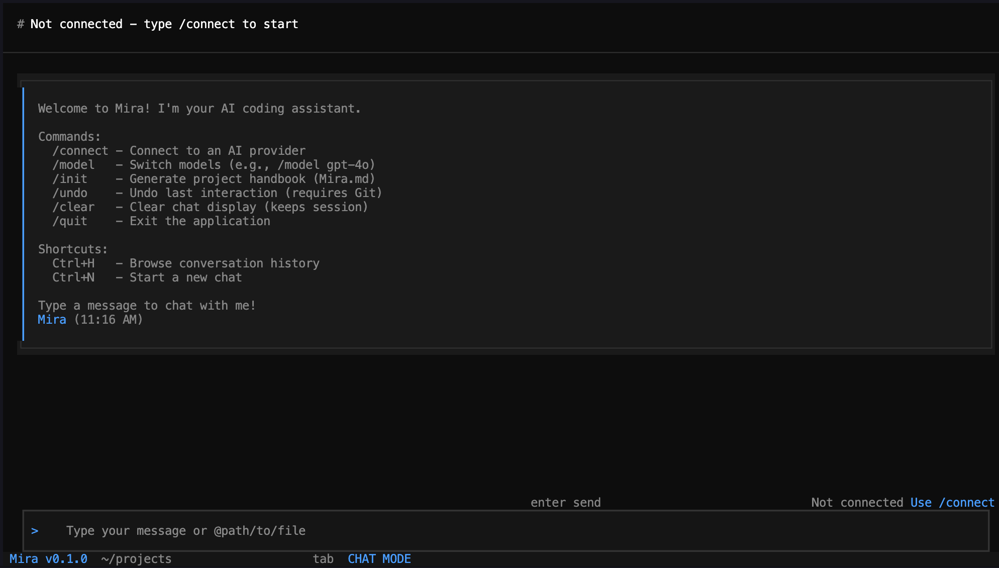

# Mira

[](https://opensource.org/licenses/MIT)
[](https://www.python.org/downloads/)

A modern, Claude code CLI-style terminal application for AI-assisted coding. Built with [Textual](https://textual.textualize.io/) for a beautiful TUI experience and powered by [LangChain](https://langchain.com/) + [LangGraph](https://langchain.com/langgraph) for intelligent agent capabilities.



## ✨ Features

- **Multi-Provider Support** - Connect to Gemini, OpenAI, or Anthropic with your API keys
- **Real-time Streaming** - See AI responses as they're generated
- **File Operations** - Read, write, and search files directly from the chat
- **Interactive Diffs** - Review and accept/reject proposed code changes
- **Session Management** - Save, browse, and restore conversation history (Ctrl+H)
- **Git Integration** - Undo last interaction with `/undo` (requires Git)
- **Project Context** - Generate AI handbook with `/init` command
- **File Mentions** - Reference files with `@filename` syntax

## 🚀 Quick Start

### Prerequisites

- Python 3.13+
- [uv](https://docs.astral.sh/uv/) package manager

### Installation

```bash
# Clone the repository
git clone https://github.com/Arnav-SAI/mira.git
cd mira

# Install dependencies with uv
uv sync

# Run the application
uv run mira
```


## 📖 Usage

### Commands

| Command | Description |
|---------|-------------|
| `/connect` | Connect to an AI provider (Gemini, OpenAI, Anthropic) |
| `/model <name>` | Switch models (e.g., `/model gpt-4o-mini`) |
| `/init` | Generate project handbook (Mira.md) |
| `/undo` | Undo last interaction (requires Git repository) |
| `/clear` | Clear chat display (keeps session history) |
| `/quit` | Exit the application |

### Keyboard Shortcuts

| Shortcut | Action |
|----------|--------|
| `Ctrl+H` | Browse conversation history |
| `Ctrl+N` | Start a new chat session |
| `Ctrl+C` | Quit the application |
| `Escape` | Quit the application |

### File Mentions

Reference files in your messages using the `@` syntax:

```
Can you refactor @src/utils.py to use async functions?
```

## 🔧 Development

```bash
# Install dependencies
uv sync

# Run in development mode
uv run python main.py

# Or use the entry point
uv run mira
```

## 📦 Dependencies

- **textual** - Modern TUI framework
- **langchain-google-genai** - Gemini integration
- **langchain-openai** - OpenAI integration  
- **langchain-anthropic** - Anthropic integration
- **langgraph** - Agent graph framework

## 🤝 Contributing

Contributions are welcome! Feel free to open issues or submit pull requests.

## 📄 License

This project is licensed under the MIT License - see the [LICENSE](LICENSE) file for details.

## 🙏 Acknowledgments

Built with [Textual](https://textual.textualize.io/), [LangChain](https://langchain.com/), and [LangGraph](https://langchain.com/langgraph).


